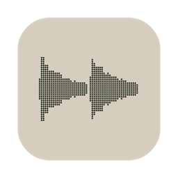

  

<h1 align="center">Chop</h1>

  A minimal 8-track DAW for macOS, built around sample chopping. 
  <a href="https://github.com/chopdaw/releases/releases/latest/download/chop.dmg"><b>Download for macOS</b></a> · <a href="https://chopdaw.app">chopdaw.app</a>

Each track holds one sample. You chop it and rearrange the slices, lay the tracks out on a timeline, mix them with hosted VST3 effects, and drive any parameter from a MIDI controller. Chop is not a plugin and not a general-purpose DAW: it has no MIDI tracks, no piano roll, no audio recording onto the timeline and no built-in effects besides a channel EQ.

**Public beta.** Free. The version of each download is on the [releases](https://github.com/chopdaw/releases/releases) page. Windows is coming soon.

## Features

- **Tracks and screens**: 8 tracks (name, colour), one sample each. Three screens: **Sample** (edit one track), **Multitrack** (arrange each track's parts, with automation) and **Mixer**.
- **Toolbar**: screen selectors, Play/Stop, Rec, Loop, metronome, position, BPM, time signature, project length, grid, key (informational), undo/redo, sample browser, MIDI Mappings and Audio/MIDI settings.
- **Samples**:
  - WAV/AIFF/FLAC/MP3, mono or stereo, loaded from a dialog, by drag & drop or from the sample browser (Folders, Favourites and Recent tabs, search, preview);
  - a file over 10 s opens an import page to pick a piece of up to 20 s, saved as a new WAV;
  - **Rec** records the audio input on the same page, only as a source of samples (no monitoring, the transport is not involved);
  - normalize and reverse never modify the file; a file edited in another program reloads when Chop comes back to the front.
- **Chopping**:
  - manual slices (double-click or the Slice tool, grid or free) and automatic slices: grid (a note value) or transients;
  - zero-crossing snap and anti-click fades; marker drags trim a slice in place;
  - Delete silences a slice or removes one block; Remove slice merges it back; copy and paste a slice's parameters.
- **Sequence**:
  - reorder, repeat and mute slices, with grid or free placement; blocks cut or crossfade over what they cover;
  - resized blocks are stretched (pitch kept, rendered in the background), varispeeded or cut to fit;
  - per-block offsets on the slice's parameters, and **Roll** (retrigger, 1/8 to 1/64 and triplets, with decay and pitch ramps);
  - up to 4 **variations** (A-D) per track, sharing the sample and slices;
  - per-track **swing** (1/8 or 1/16, 50-75 %);
  - the waveform shows the arranged result.
- **Tracks**:
  - mono/poly voices;
  - pitch, gain and reverse per track and per slice; ADSR and a low-pass filter per slice (the track's apply while it has no slices);
  - loop fitted to whole bars with time-stretch (pitch kept), varispeed, beats (REX-style: slices moved to the tempo, played at their own speed) or original speed;
  - duplicate a track's content into an empty track; **resample** one pass of a track through its inserts into a free track.
- **Multitrack**: each track's parts are passes of one of its variations: move, duplicate, delete, switch variation. Play starts from the ruler cursor and loops over the loop range.
- **Automation**: per part, one lane under the tracks (volume, pan, sends, insert on/off, pitch, EQ band gains); drawn with points, lines and pencil, or recorded from a MIDI controller (latched until Stop); Read/Write per track.
- **Mixer**:
  - 8 tracks, 4 returns and a master, LED peak meters;
  - 4 VST3 inserts per strip; plugins are scanned out of process with a blacklist, managed on the **VST3 Plugins** page (File menu: scan, folders, enable/disable);
  - a simple channel EQ on every strip (HPF, LPF, HF/LF shelf or bell, two mids), after the inserts;
  - 4 sends per track (1-2 pre-fader, 3-4 post-fader);
  - automatic delay compensation; plugins get the project's tempo and position.
- **MIDI**: every parameter responds in real time and can be mapped with MIDI Learn (right-click any control), also to the selected track or slice; relative encoders and 14-bit CCs; a **MIDI Mappings** page. MIDI never triggers sound.
- **Undo**: every edit can be undone; a knob or marker drag is one step.
- **Export**: mix, stems or the slices of a track, to WAV at 16 (dithered), 24 or 32-bit float, with an optional 2 s tail.
- **Projects**: `.chop` files (samples inside the project folder are saved with relative paths), Open Recent, Collect Samples, a prompt for unsaved changes, **autosave** every 5 minutes to a separate copy and recovery after a crash.
- **Window**: resizable and full screen (minimum 1320 × 840), interface zoom 75-150 %.

## System requirements

- **macOS**: macOS 11.5 (Big Sur) or later, on a Mac with an Apple M1 chip or better. Intel Macs are not supported.
- **Memory**: 8 GB of RAM.
- **Screen**: 1440 × 900 or larger, in logical pixels (after the system's display scaling). The window opens at 1320 × 840, which is also its smallest size, so the menu bar and the title bar must fit around it.
- **Audio**: any audio device macOS supports and, to record samples, an audio input. A MIDI controller and VST3 effects are optional: Chop has no built-in effects besides the channel EQ.

## Install

Download [chop.dmg](https://github.com/chopdaw/releases/releases/latest/download/chop.dmg), open it and drag Chop into Applications.

## Feedback

Questions and bug reports: [feedback@chopdaw.app](mailto:feedback@chopdaw.app). Everything else: [info@chopdaw.app](mailto:info@chopdaw.app).

## License

© 2026 Chop. All rights reserved. Chop is closed source and free to use. This repository holds only the downloads.

Chop uses [JUCE](https://juce.com), the VST3 SDK and [Signalsmith Stretch](https://github.com/Signalsmith-Audio/signalsmith-stretch). The licences of the third-party software it includes are shown in the app (About Chop > Licences).
